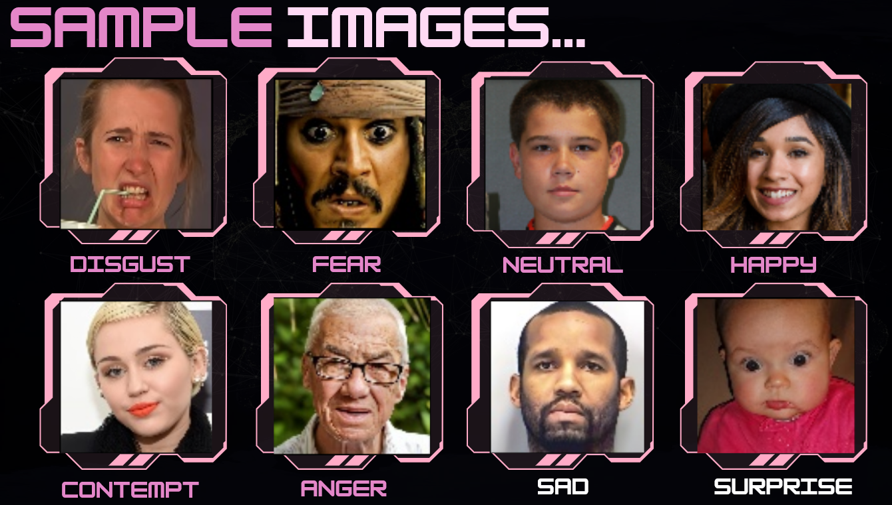
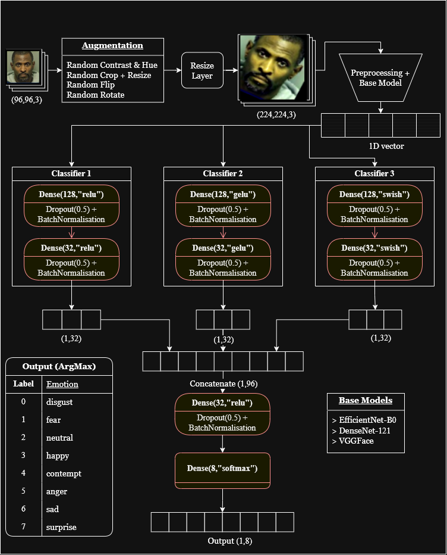

# 📊 Facial Emotion Recognition (AffectNet)

## 📌 Overview
- Task: Multi-class Image Classification  
- Domain: Computer Vision  
- Dataset: AffectNet  
- Total Images: ~28,000  
- Classes: 8 (Disgust, Fear, Neutral, Happy, Contempt, Anger, Sad, Surprise)  
- Image Size: 96×96×3  

---

## ⚙️ Pipeline
- Data Cleaning: Removed ambiguous samples  
- Train-Test Split applied  

### Data Augmentation (4 types)
- Rotation  
- Hue & Contrast  
- Crop + Resize  
- Horizontal Flip  

---

## 🧠 Models Used (3)
- EfficientNet-B0  
- DenseNet-121  
- VGGFace  

---

## 🔗 Ensemble Setup
- Feature extraction from all 3 models  
- Passed to 3 FNN classifiers:
  - Activations: ReLU, GELU, Swish  
- Outputs concatenated → Final classification layer  

---

## ⚡ Training Details
- Batch Size: 32  
- Input Shape: (96, 96, 3)  
- Transfer Learning used  
- Model-specific learning rates  

---

## 📈 Results (Key Observations)
- Ensemble > Individual models  
- DenseNet-121 → Best individual performance  
- EfficientNet-B0 → Best efficiency (low compute)  
- VGGFace → High performance, high parameters  

---

## 📊 Key Learnings
- Ensemble improves performance  
- Data augmentation improves generalization  
- Transfer learning reduces training cost  
- Trade-off: Accuracy vs Computation  

---

## 📂 Dataset
- Note: The original AffectNet dataset is not publicly available and the previously used link is no longer active.

### Secondary Source (for reproducibility)
- https://huggingface.co/datasets/Mauregato/affectnet_short  

> This is a publicly available subset/version of AffectNet used to reproduce results. 

---

## 🛠️ Tech Stack
- Python  
- TensorFlow / Keras  
- NumPy  
- OpenCV  

---

## 📎 Highlights
- 3 CNN Models  
- 3 Classifiers  
- 8-Class Classification  
- ~28K Images  
- End-to-End Pipeline

## Sample Images

## Workflow 

